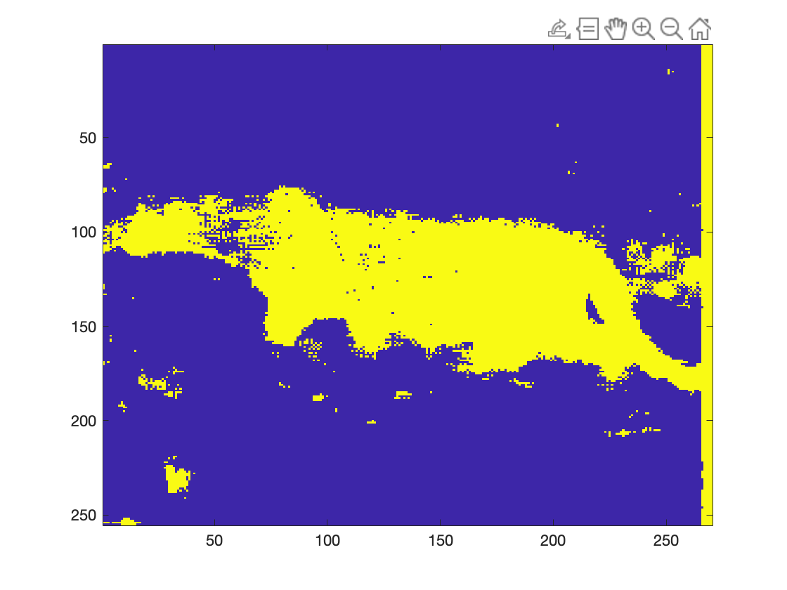
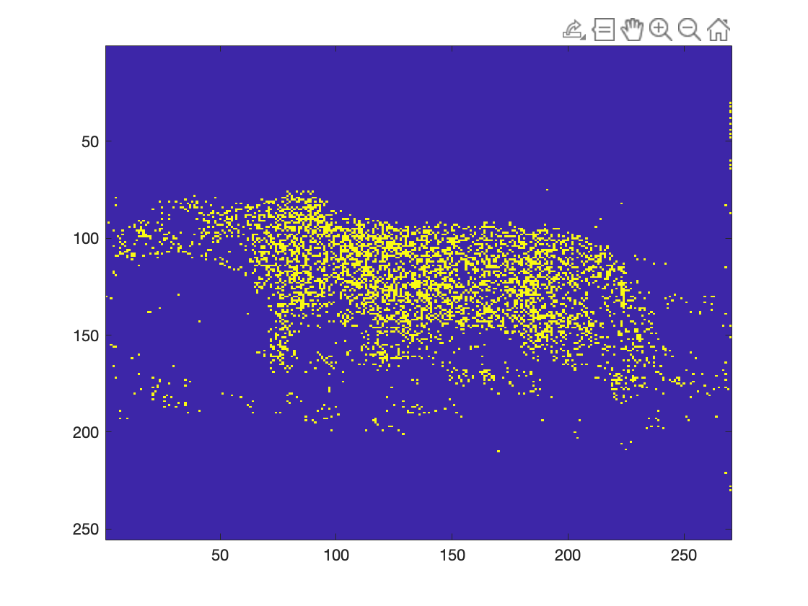

# CheetahSegment - FA21 ECE271A
Segment a cheetah using traditional statistical learning methods including
- Gaussian Classifier BDR

  - Treat the probability distribution of likelihood as gaussian. Do BDR by it.

  

- Bayesian Decision

  - Treat parameters as random variables. Integral and get the predictive distribution to do BDR.

  

- EM with Gaussian Mixture

  - Using gaussian mixture to fit the data and classify cheetah.

  Forget to save a graph.
